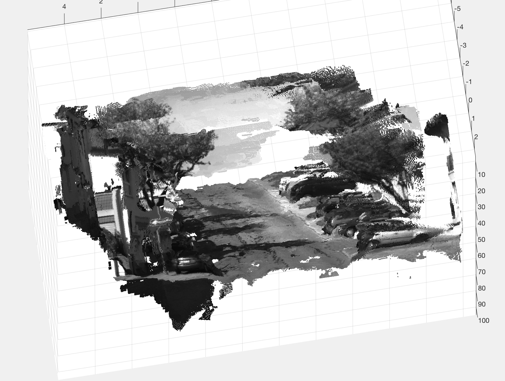
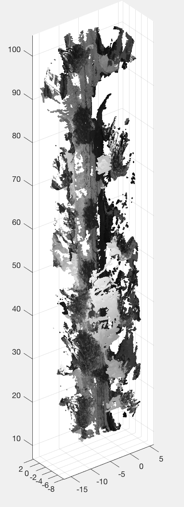
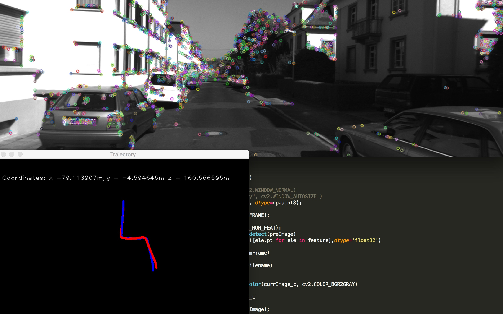

### Requirement
* Python 3.5
* Numpy
* OpenCv

### Introduction

There are currently two files in the src folder,  one is for the simple mono Visual Odometry and the other one is for 3D reconstruction.

The dataset tested is from part of Kitty odometry data set.

### Reference
1. [Fall 2017 - Vision Algorithms for Mobile Robotics](http://rpg.ifi.uzh.ch/teaching.html)
2. [Monocular Visual Odometry using OpenCV](http://avisingh599.github.io/vision/monocular-vo/)| Avi Singh
