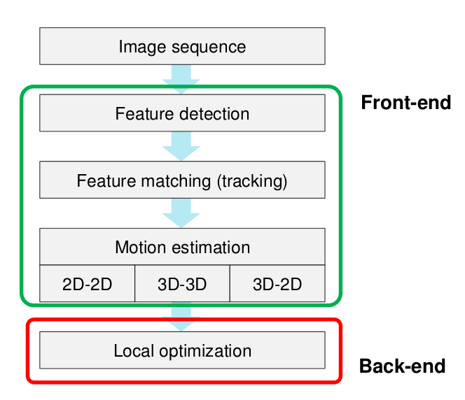
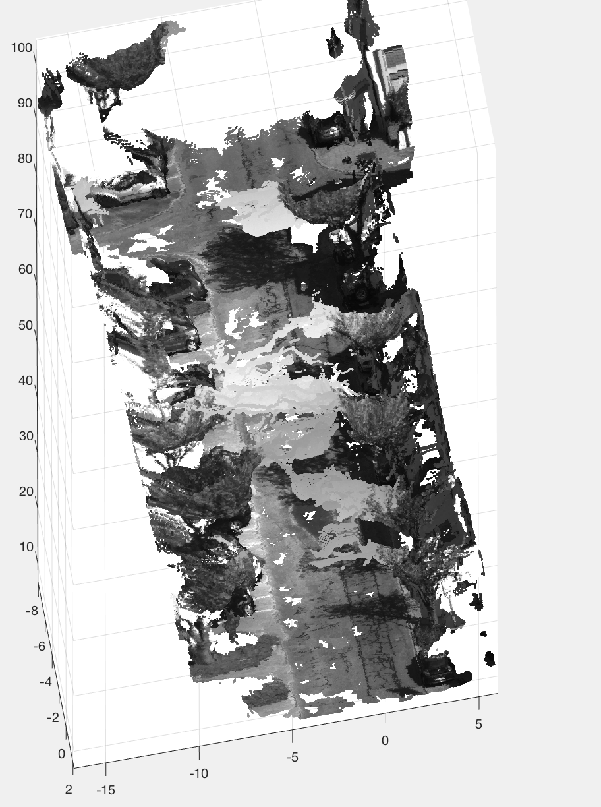
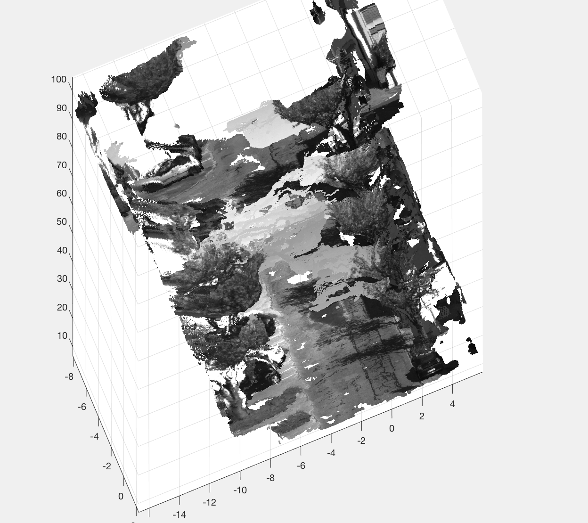
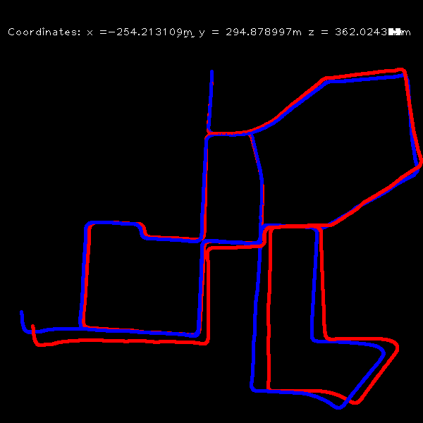
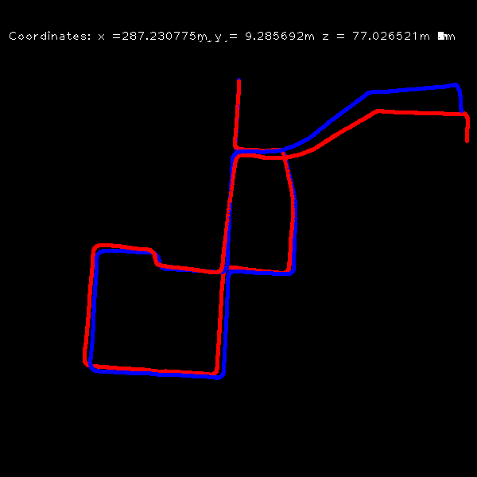
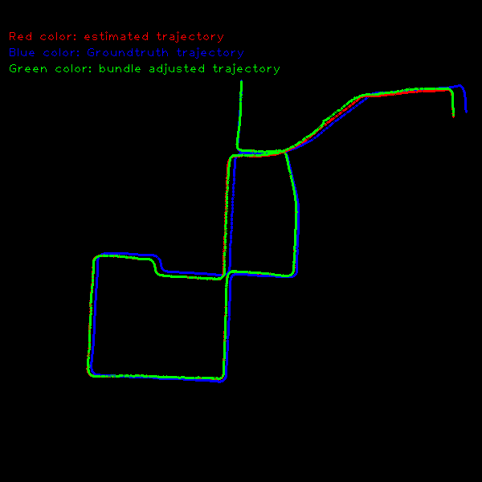

### Requirement
* Python 3.5
* Numpy
* OpenCV 3.0
* Kitti data or you own data
* Tested with cmake on my mac
* For c\_plus\_version\_2 you need **g2o** for optimization

### Introduction

#### Python Files


The **python** file folder contains the source code with Python scripts for 2D-2D mono Visual Odometry, 3D reconstruction, and  3D-2D visual odometry. You have to change the address of source files for images. The basic idea for 3D-2D visual odometry is to initialize the 3D points first as landmarks with template feature matching from image pairs, and then find the tracking points with OpenCV KLT tracking algorithm, then use the landmarks, tracked points and p3p to find the pose of camera and keep adding new landmarks as time goes.

The dense 3D reconstruction is done with OpenCV function **cv2.StereoSGBM_create** to create the stereo image pair and then use this image pair to compute the disparity and then further calculate the depth because the two cameras are parallel with each other and the offset is provided by Kitti data set. Then it is easy to recover the 3D coordinate of all points in the disparity image.

<!---->

<!---->

For the 2D-2D visual mono odometry case, the scale between frame is very important since we only have images from one camera, and I choose to use the scale from the absolute pose data provided by Kitti data, the recovered pose is plotted

<br><br>

#### C++ Files
##### Version 1
In order to add optimization to the mapping and localization steps, I have rewritten the source files with **C++**. In version 1, the 3D-2D visual odometry pipeline is implemented with the above mentioned approach but without use of any optimization technique in the back-end and you do not need to install any additional optimization package. In the feature matching step, the feature extractor **orb***method is used since it is free to use, if you want to use **sift** or **surf** feel free to change it to the name you want. 

In this approach, there is no scale because all the 3D coordinate of the objects are based on the first frame and then all the pose recovered based on the first frame, so we can skip the step to estimate scale, but no optimization is used in this version and I run the program for 2000 frames, and below is the output trajectory of came in these 2000 frames



##### Version 2
In the **C++** version 2, I added bundle adjustment to perform optimization in the backend and I choose to use the graph optimization package **g2o** for bundle adjustment. In order to install  **g2o** in you machine, you have to refer [this](https://github.com/RainerKuemmerle/g2o) for additional information. The basic idea is to optimize both the pose and 3D landmark and minimize the reprojection error between these 3D points, 2D feature points with recovered poses. In my implementation, the world 3D points-landmarks are stored and each frame only observe a subset of 3D points from these 3D points, and 3D landmark points keeps adding when new frame comes. 

You can choose to run it online way or offline way. In the offline way, you have to wait until all the frames has been processed and optimize all batches with one shot. Of course, it is slow because the 3D landmark points keep accumulating and there are many landmarks to optimize, so it is slow. As for the online approach, you can choose to optimize only several frames together and continuing the processing for the other frames. I used the offline processing for 2000 frames, since it is not very complex model. For the image below, you can see that trajectories optimized with **bundle adjustment** is more closely aligned with the ground truth trajectory, so it means optimization works.




Notice that the trajectories are very sensitive to matching points, so be careful to choose the good matching points int the feature extraction stage. In the left plot, the matching points are OK but with deviation from ground truth path. In the right plot, I used a different matching parameter and now the trajectory is much better.

I have not used any loop detection technique, so the errors still accumulating with more frames comes. A real implementation requires loop detection to eliminate error. Otherwise, error keeps increasing even you have bundle adjustment.

### How to run

git clone : 

In the python files, you can simply run, here python is python3

```
python filename
```
But you need to set your data path to the correct data path, you can download data [here](https://drive.google.com/drive/folders/0B4ORAVKduZjIWFh0V0piSEFzYmM?usp=sharing)

For the c++ files, you have to run below to get it running. Again, you have to modify the data path in the main file.

```
mkdir build
cd build
cmake ..
make
```

Then run the executable files, following the instruction
In the c\_plus_version\_1, you can run
```vo 2000```, it tells the program to run for 2000 frames.

In the c\_plus_version\_2, you can run 

```vo 2000 2000 1``` 

to run program with 2000 frames and optimization after 2000 frames, 1 for use optimization and 0 for not use optimization.

### Further Work
You can improve the above work with good feature extraction scheme and how to handle new landmarks and remove old landmarks, and adding useful part to make it more realistics.

### Reference
1. [Fall 2017 - Vision Algorithms for Mobile Robotics](http://rpg.ifi.uzh.ch/teaching.html)
2. [Monocular Visual Odometry using OpenCV](http://avisingh599.github.io/vision/monocular-vo/)| Avi Singh
